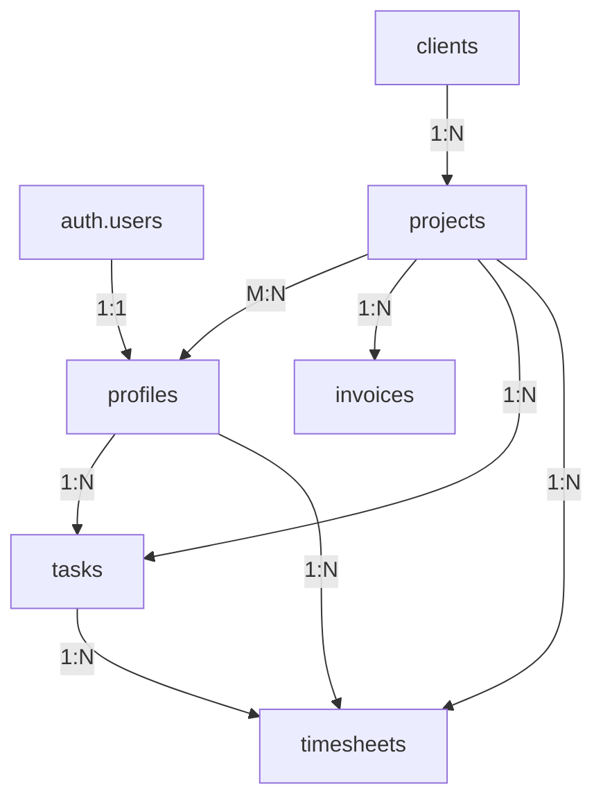

# Backend Architecture - Guide Complet

## 📊 Schéma de Base de Données

### Tables Principales
- ✅ **profiles** - Utilisateurs (lié à `auth.users`)
- ✅ **clients** - Gestion clients (prospect → actif → pause → perdu)
- ✅ **projects** - Projets avec budgets et équipes
- ✅ **project_members** - Assignations des membres aux projets
- ✅ **invoices** - Facturation (accès restreint Admins uniquement)
- ✅ **tasks** - Tâches avec dépendances et estimations
- ✅ **timesheets** - Suivi du temps
- ✅ **audit_logs** - Traçabilité des modifications critiques

## 🔒 Sécurité RLS (Row Level Security)

### Hiérarchie des Rôles
1. **Admin** - Accès total à toutes les données
2. **PM** (Project Manager) - Gestion de leurs projets + équipes assignées
3. **Dev/Designer** - Accès limité aux projets assignés uniquement

### Politiques Principales
| Table | Admin | PM | Dev/Designer |
|-------|-------|----|----|
| **Clients** | ALL | READ (projets assignés) + INSERT/UPDATE | READ (projets assignés) |
| **Projects** | ALL | INSERT + UPDATE/DELETE/READ (assignés) | READ (assignés) |
| **Invoices** | ALL | ❌ Aucun accès | ❌ Aucun accès |
| **Tasks** | ALL | ALL (projets assignés) | READ (projets) + UPDATE (assigné) |
| **Timesheets** | READ (tous) | READ (projets assignés) | ALL (propres) |

## ⚡ Optimisations de Performance

### Indexes Créés (25+)
- **Foreign Keys** - Tous indexés pour les JOINs rapides
- **Colonnes Fréquentes** - `status`, `role`, `email`, `date`
- **Composites** - `(user_id, date)` pour timesheets
- **GIN Index** - Array de tags pour recherche rapide

### Contraintes de Validation
```sql
✓ Montants positifs (LTV, budgets, factures, heures)
✓ Dates cohérentes (start_date ≤ end_date)
✓ Budget utilisé ≤ budget total
✓ Heures > 0
```

## 🔧 Fonctions Utilitaires

```sql
-- Vérifications de rôles
public.is_admin() → BOOLEAN
public.is_pm() → BOOLEAN
public.is_project_member(project_uuid) → BOOLEAN
public.get_user_role() → user_role

-- Audit logging
public.log_audit(table, record_id, action, old_data, new_data) → VOID
```

## 📝 TypeScript Integration

```typescript
import { Database } from './types/supabase'

// Types auto-générés
type Profile = Database['public']['Tables']['profiles']['Row']
type Client = Database['public']['Tables']['clients']['Row']
type Project = Database['public']['Tables']['projects']['Insert']
```

## 🚀 Installation

### 1. Dans Supabase Dashboard
```bash
# Ouvrir SQL Editor et exécuter :
supabase/schema.sql
```

### 2. Variables d'Environnement
```env
VITE_SUPABASE_URL=your-project-url
VITE_SUPABASE_ANON_KEY=your-anon-key
```

## 🎯 Améliorations Implémentées

### Sécurité
- [x] RLS activé sur toutes les tables
- [x] Politiques granulaires par rôle
- [x] Fonctions SECURITY DEFINER
- [x] Audit trail complet
- [x] Validation des données (CHECK constraints)

### Performance
- [x] 25+ indexes stratégiques
- [x] Indexes composites pour requêtes complexes
- [x] GIN index pour recherche de tags
- [x] Auto-update de `updated_at`

### Intégrité
- [x] Contraintes NOT NULL appropriées
- [x] Foreign keys avec CASCADE/SET NULL
- [x] Validation des montants positifs
- [x] Validation des plages de dates
- [x] Budget controls

### Fonctionnalités
- [x] Auto-création de profil à l'inscription
- [x] Système d'audit logging
- [x] Support des dépendances de tâches
- [x] Tracking LTV clients
- [x] Pipeline de vente

## ⚠️ Points d'Attention

> [!IMPORTANT]
> Les **factures** sont accessibles UNIQUEMENT aux Admins. Les PMs et Devs n'y ont aucun accès.

> [!TIP]
> Utilisez `log_audit()` pour tracker les modifications importantes (changements de budget, statuts de factures, etc.)

> [!NOTE]
> Après avoir créé un projet, le PM doit s'ajouter à `project_members` pour le gérer.

## 📊 Architecture Complète



## ✅ Validations Backend

Le schéma SQL actuel garantit :
1. ✅ **Performance** - Toutes les requêtes optimisées avec indexes
2. ✅ **Sécurité** - RLS strict selon hiérarchie de rôles
3. ✅ **Intégrité** - Contraintes sur montants et dates
4. ✅ **Traçabilité** - Audit logs pour changements critiques
5. ✅ **Scalabilité** - Architecture extensible et documentée
